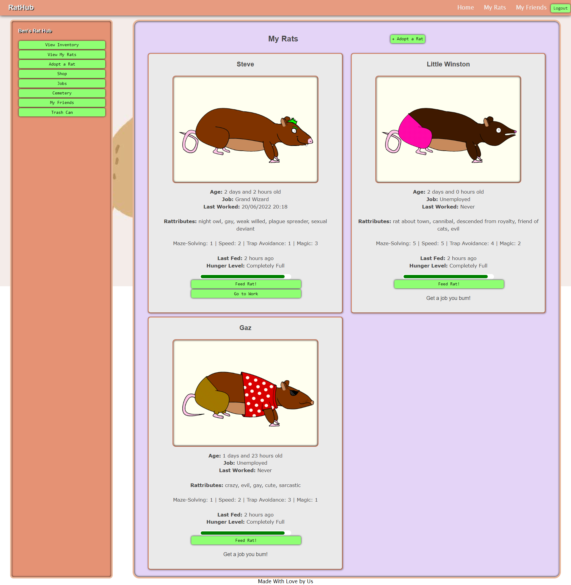
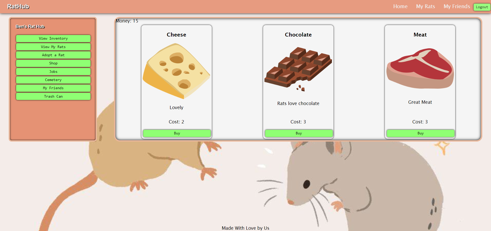
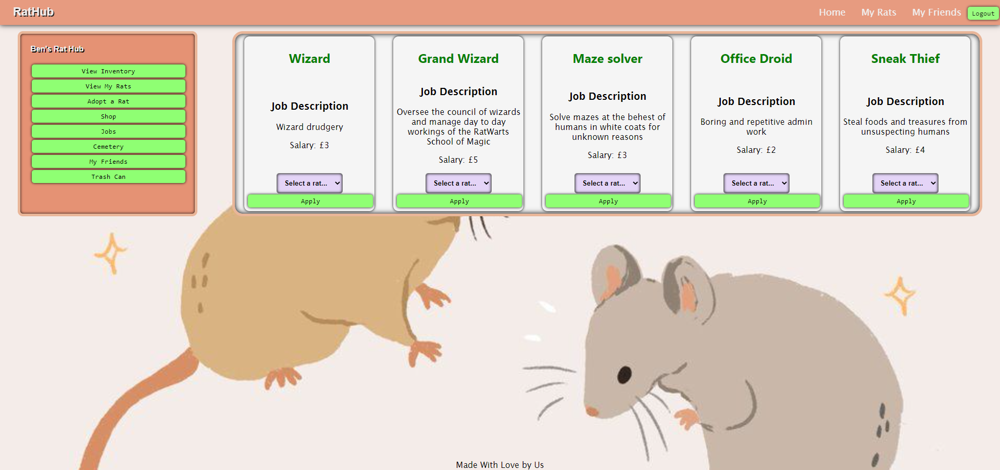

<h1 align="center"> 🏃 README Style Guide 📝</h1>
<h2 align="center"> Subheading Here. <i> Version 1.0.0 </i> </h2>

<strong>Quick and READ ME!</strong> is an easy-to-use, command-line interface that helps a user to quickly create a professional README markdown file. Created in <em>Node.js</em> with the <em>Inquirer npm package</em>, it can be run on a local machine from the command line. It will invite a user to answer a series of question prompts about their current project, and generate a simple README file based on their input. The user is then free to copy across to their own project's repository. 

One stop shop for your virtual pet rat experience! 

Adopt and customise your very own pet rat. Keep your rats happy, fed and watered. Help your rats find work, friends and lead a fulfilling life.

## Table of Contents
    
* [01. About](#about)
* * [01A. Project History](#project-history)
* * [01B. Demonstration Video](#demonstration-video)
* * [01C. Live Deployment](#live-deployment)
* [02. Key Features](#key-features)
* * [02A-E Key Feature A - E](#key-feature-a)
* [03. Installation](#installation)
* * [03A. Prerequisites](#prerequisities)
* * [03B. Cloning the Repository](#cloning-the-repository)
* * [03C. Running the Project Locally](#running-the-project-locally)
* [04. Usage](#usage)
* * [04A-E. Key Usage Features](#key-usage-a)
* [05. Testing](#testing)
* [06. Version History](#version-history)
* [07. License](#license)
* [08. Contribution](#contribution)
* * [08A. Contribution Guidelines](#contribution-guidelines)
* * [08B. Future Development](#future-development)
* [09. Questions](#questions)

## About
### Project History
Group project - want to emphasise it was my idea
Feedback - maybe a seperate section; employers calling it inventive. Explain the day event thing.
### Demonstration Video
Worthtrying to record this sooner rather than later
### Live Deployment
Was deployed on Heroku; hoping to deploy with an EC2 instance (watch that video tonight)
## Key Features
### Key Feature A
### Technology Stack

### Frontend
----
- ReactJS
- Custom CSS
- jQuery
----
### Backend
----
- NodeJS
- Express
- Apollo
- GraphQL
- bcrypt
- JSON Web Token
- Mongo DB
- Mongoose
## Installation
For installing locally? Contribution guide below.
### Prerequisities
MongoDB Atlas/Compass; node/npm; anything else?
### Cloning the Repository
### Running the Project Locally
npm run start / live editing - no build yet (might be worth briefly explaining that, and double checking)
## Usage
### Key Usage A

Upon visting the RatHub website you will be prensenting with a login/signup page. In order to proceed further into application you will need to create an account and log in. 

Once you have logged in you will be presented with the opportunity to adopt your first rat - click the Adopt a Rat button! This will open the rat designer and allow you to customise the look of your rat, name it and adopt it.

After adopting your rat you will be taken back to the View My Rats page and your new rat will be visible with all of it's information. Each rat has it's own Rattributes and ChaRATeristics.

Much of the app is still under construction or in need of some polishing, but you can buy items/food, feed your rat and find it a job. 

## What it Looks Like

## Testing
No tests - unit tests, React testing library ?
## Version History
### Version 1.0.0
Bootcamp project.
## License
Are we in agreement over this? Did we give it a license.
## Contribution
### Meet the Contributors
Links to everyone's GitHub.
### Contribution Guidelines
## Contributing

Daniel Bowen

Ben Growcott - [GitHub](https://github.com/BGrowcott)

Ayaanle

Fatumo

Girish

### Future Development
Ben put lots in here.

## Future Development

Lots to talk about here!

In the very short term we are ironing out kinks and completing the functionality of the current features:

- Feeding your rat
  - Feeding your rat will require the use of an item you've bought.
  - Different foods bought in the shop will provide levels of sustenuance.

- Getting a job
  - Jobs will have requirements e.g Grand Wizard job will have a ChaRATeristic require meant of level 5.
 
- Search the Trash
  - Searching the trash once per day will provide the user with a random item

- Cemetary 
  - Rats can actually die when they are left uncared for.
  - Dead rats will appear in the graveyard

- Friends
  - Allow a user to connect with others and view their rats

Longer term:

  - Mini games
  - Rat battles
  - Rats in love
  - Happiness rating
  - More lore
  - Rat health and medicine
  - More items and grater customisation of your rats
  - Features more complex in general

## Questions

If you have any questions or suggestions please contact me via my GitHub or Email:

